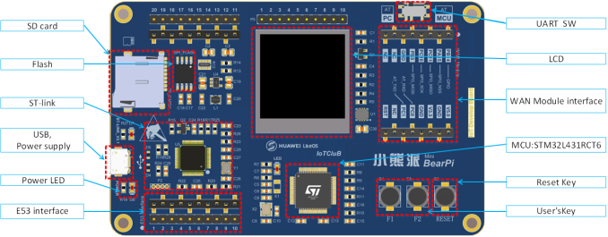

---
# BearPi-IoT Std
### 快速导航
| No | 类别 | 路径  |
| :----: | ---- |  ------------------------------------------------------------ |
| 1    | 开发板硬件资料 | [docs/hardware](/docs/hardware) |
| 2    | 技术支持提问 | [ISSUES](https://gitee.com/bearpi/bearpi-iot_std/issues) |
| 3    | 常见问题解答 | [doc/device-dev/常见问题.md](docs/device-dev/常见问题.md) |

## 一、BearPi-IoT  开发板介绍

BearPi-IoT Std开发板是由南京小熊派智能科技有限公司基于STM32L431RCT6设计的高性能物联网开发板。开发板充分考虑物联网感知层设备的多样性，具有强大的可扩展性，用于提供给开发者评估及快速设计相关物联网的应用产品。

开发板已适配支持：[LiteOS](https://gitee.com/bearpi/bearpi-iot_std_liteos)、[TencentOS Tiny](https://gitee.com/bearpi/bearpi-iot_std_tencentos-tiny)、[RT-Thread](https://gitee.com/bearpi/bearpi-iot_std_rt-thread)等实时操作系统，可快速实现物联网端到端案例开发。

### 购买地址 [点击购买](https://item.taobao.com/item.htm?id=608002911209)

## 二、手把手教程系列

- [1. 初识BearPi-IoT_Std开发板](docs/device-dev/初识BearPi-IoT_Std开发板.md)
- [2. 开发环境搭建](docs/device-dev/开发环境搭建.md)
- [3. 源码获取](docs/device-dev/源码获取.md)
- [4. 如何编译及烧录程序](docs/device-dev/编译代码及烧录.md)
- [5. 常见问题](docs/device-dev/常见问题.md)

## 三、 单片机基础开发索引
BearPi-IoT Std提供多个STM32基础案例，方便初学者由浅入深逐步学习。您拿到工程后经过简单的编程和下载即可看到实验现象。

* `A1 - A99`：基础外设类
* `B1 - B99`：E53传感器类

以下部分基础案例代码讲解可参考[视频教程](https://www.bilibili.com/video/BV1S5411x71A)

例程列表如下所示：

| 编号 | 类别   | 例程名           | 说明                                                         |
| ---- | ------ | ---------------- | ------------------------------------------------------------ |
| A1   | 基础   | basic_led        |   [蓝色 LED 不间断闪烁](/applications/A1_basic_led)  |
| A2   | 基础   | basic_key            |  [轮训方式读取按键状态，并控制LED灯](/applications/A2_basic_key)|
| A3   | 基础   | basic_key_irq            |   [中断方式读取按键状态，并控制LED灯](/applications/A3_basic_key_irq )|
| A4   | 基础   | basic_uart            |   [串口收发测试](/applications/A4_basic_uart)|
| A5   | 基础   | basic_dac             |   [DAC模拟电压输出](/applications/A5_basic_dac)|
| A6   | 基础   | basic_adc_dma           |    [ADC读取电压](/applications/A6_basic_adc_dma)|
| A7   | 基础   | basic_tim2        |   [定时器控制LED闪烁](/applications/A7_basic_tim2)|
| A8   | 基础   | basic_spi_lcd           |  [SPI屏幕测试](/applications/A8_basic_spi_lcd)|
| A9   | 基础   | basic_flash          |   [内部flash读写测试](/applications/A9_basic_flash)|
| A10   | 基础   | basic_qspi_w25q64          |   [外部W25Q64 flash读写测试](/applications/A10_basic_qspi_w25q64)|
| A11   | 基础   | basic_sdio_sdmmc1       |   [外部SD卡读写测试](/applications/A11_basic_sdio_sdmmc1)|
| A12   | 基础   | basic_sdio_sdmmc1_fatfs       |  [外部SD卡文件系统读写测试](/applications/A12_basic_sdio_sdmmc1_fatfs)|
| B1   | E53传感器   | e53_sc1_pls               | [E53_SC1案例扩展板测试](/applications/B1_e53_sc1_pls)|
| B2   | E53传感器   | e53_ia1_temp_humi_pls     | [E53_IA1案例扩展板测试](/applications/B2_e53_ia1_temp_humi_pls)|
| B3   | E53传感器   | e53_sf1_smoke             | [E53_SF1案例扩展板测试](/applications/B3_e53_sf1_smoke)|
| B4   | E53传感器   | e53_sc2_axis              | [E53_SC2案例扩展板测试](/applications/B4_e53_sc2_axis)|
| B5   | E53传感器   | e53_st1_gps               | [E53_ST1案例扩展板测试](/applications/B5_e53_st1_gps)|
| B6   | E53传感器   | e53_is1_infrared          | [E53_IS1案例扩展板测试](/applications/B6_e53_is1_infrared)|

## 四、端云案例开发索引

BearPi-IoT Std已完全适配华为LiteOS、腾讯TencentOS-tiny、RT-Thread等物联网操作系统，并与华为云物联网平台、腾讯物联网平台、阿里云物联网平台实现对接，开发者可根据自己的需求选择不同的操作系统及云平台。

- [1. 基于华为LiteOS操作系统，对接华为云物联网平台](https://gitee.com/bearpi/bearpi-iot_std_liteos)
- [2. 基于腾讯TencentOS-tiny操作系统，对接腾讯物联网平台](https://gitee.com/bearpi/bearpi-iot_std_tencentos-tiny)
- [3. 基于RT-Thread操作系统，对接阿里云物联网平台](https://gitee.com/bearpi/bearpi-iot_std_rt-thread)

## 五、联系我们

