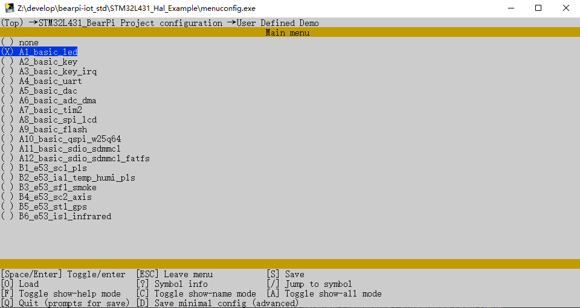
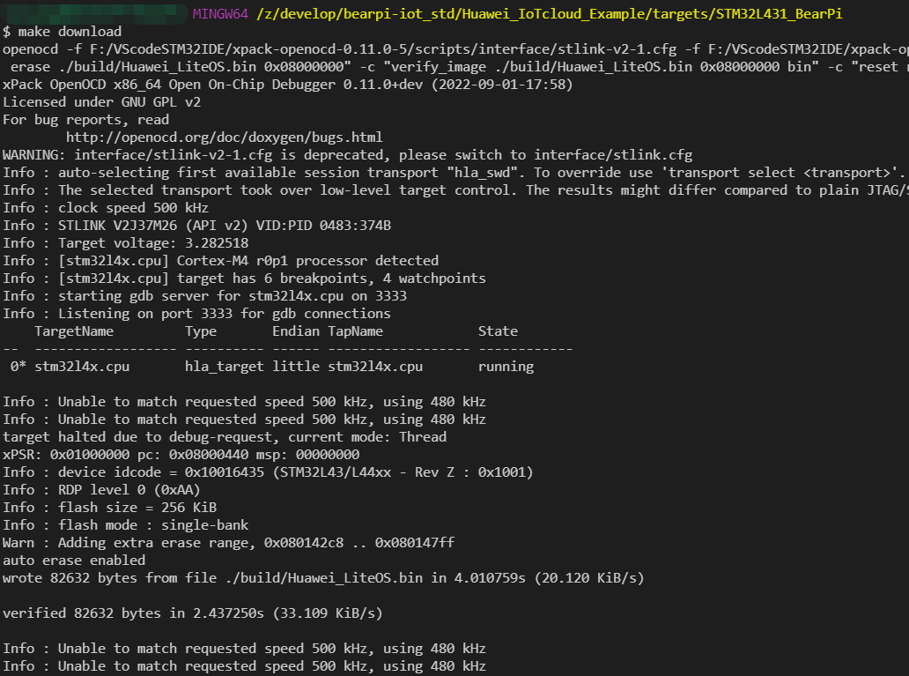

# BearPi-IoT_Std通过GCC编译代码及烧录

## BearPi-IoT_Std代码编译概述

本文档将介绍如何采用GCC编译BearPi-IoT_Std的代码，在这之前请先完成[开发环境搭建](GCC编译开发环境搭建.md)的内容。


## 编译代码
1. 打开bash窗口

    先使用vscode打开源码目录，然后通过键盘“Ctrl + Shift+ ~”快捷键打开bash窗口

    
    
2. 选择工程案例

    ```
    start menuconfig.exe
    ```
    通过键盘的“回车”，“空格”按键，选择对应案例，通过键盘的“Esc”，“Y”按键，退出并保存。

    

3. 编译工程

    ```
    make clean
    make -j8
    ```
## 烧录代码

1. 将开发板通过USB线与电脑连接
2. 修改OpenOCD路径，将Makefile中的DEVELOPTOOLS_ROOT修改为对应的developTools安装路径。
    

3. 在编译目录下输入

```
make download
```

