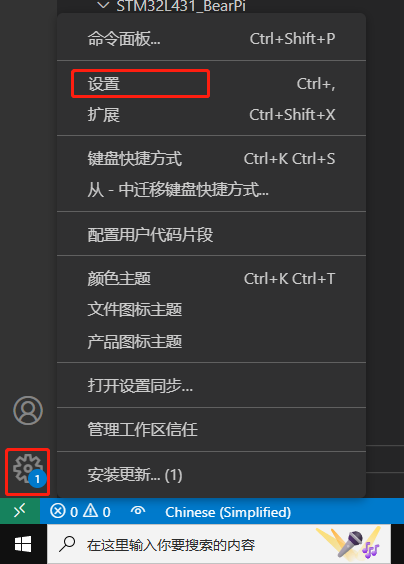
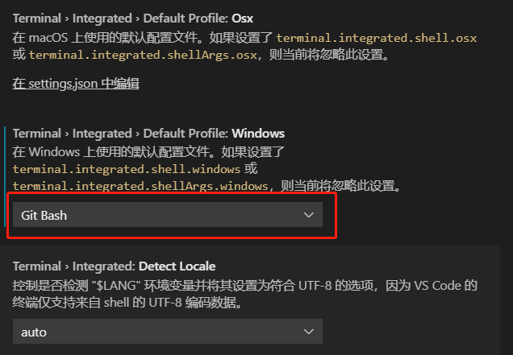

# Makefile编译开发环境搭建

## 硬件要求

-   Windows工作台（主机电脑 Win10+）
-   BearPi-IoT Std开发板
-   USB Micro线（Windows工作台通过USB与BearPi-IoT Std开发板连接）

一、工具下载：

1、一键安装开发依赖包

依赖包下载地址：

链接：https://pan.baidu.com/s/1CzsM1oaaPIbh4DbCPIcC6A?pwd=1234 
提取码：1234

 将一键安装包解压到任意目录，运行 developTools.exe，按提示安装（安装路径一定不能有中文、空格、特色字符等），并记住安装路径。

2、安装代码编辑工具Visual Studio Code（代码编辑工具）

下载并安装Visual Studio Code：https://code.visualstudio.com/

- 将VsCode更改终端为bash终端
1. 打开VsCode，点击左下角的齿轮，展开点击“设置”。

    
    
2. 搜索shell，找到Terminal › Integrated › Default Profile: Windows设置,选择 Git Bash.

    