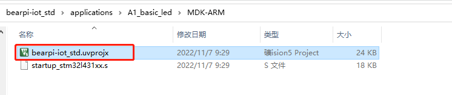
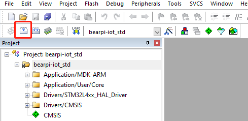
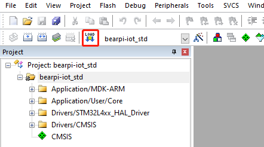

# BearPi-IoT_Std通过MDK（Keil 5）编译代码及烧录

## BearPi-IoT_Std代码编译概述

本文档将介绍如何采用MDK编译BearPi-IoT_Std的代码，在这之前请先完成[开发环境搭建][MDK编译开发环境搭建.md]的内容。

## 编译代码
1. 打开工程(以A1_basic_led为例)
    双击applications\A1_basic_led路径下的工程文件，打开工程。

    <table><tbody><tr><td></td></tr></tbody></table>

2. 编译

    选择project菜单，点击Build Project编译工程。

    如果工具栏上有编译按钮快捷键，可以直接点击工具栏上的编译按钮：

    <table><tbody><tr><td></td></tr></tbody></table>

## 烧录代码

1. 将开发板通过USB线与电脑连接

2. 烧录
    选择Flash菜单，点击Download下载程序到开发板上并运行。

    如果工具栏上有下载按钮快捷键，可以直接点击工具栏上的下载按钮：

    <table><tbody><tr><td></td></tr></tbody></table>
