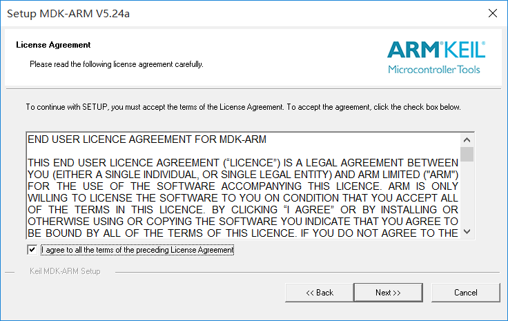
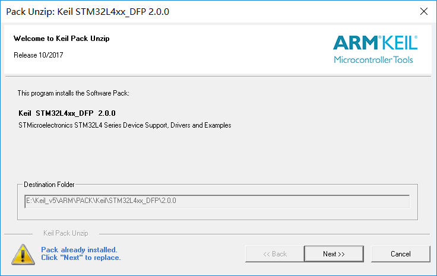

# MDK（Keil 5）编译开发环境搭建

## 硬件要求

-   Windows工作台（主机电脑 Win10+）
-   BearPi-IoT Std开发板
-   USB Micro线（Windows工作台通过USB与BearPi-IoT Std开发板连接）

## 开发搭建环境
### 1.1 MDK软件介绍
MDK 即RealView MDK 或MDK-ARM（Microcontroller Development kit），是 ARM 公司收购Keil公司以后，基于uVision界面推出的针对ARM7、ARM9、Cortex-M0、Cortex-M1、Cortex-M2、Cortex-M3、Cortex-R4等ARM处理器的嵌入式软件开发工具。MDK-ARM 集成了业内最领先的技术，包括 uVision4 集成开发环境与 RealView 编译器RVCT。支持 ARM7、ARM9 和最新的Cortex-M3/M1/M0 核处理器，自动配置启动代码，集成 Flash 烧写模块，强大的 Simulation 设备模拟，性能分析等功能，与 ARM 之前的工具包 ADS 等相比，RealView 编译器的最新版本可将性能改善超过 20%。
Keil公司开发的ARM开发工具MDK，是用来开发基于ARM核的系列微控制器的嵌入式应用程序。它适合不同层次的开发者使用，包括专业的应用程序开发工程师和嵌入式软件开发的入门者。MDK包含了工业标准的Keil C编译器、宏汇编器、调试器、实时内核等组件，支持所有基于ARM的设备，能帮助工程师按照计划完成项目。

### 1.2 MDK安装
1. 登录MDK官网，下载MDK5软件，下载地址：
    http://www2.keil.com/mdk5  或者 https://www.keil.com/download/product/
    下载的版本最好在5.24以上，本开发教程以5.24版本为例，双击MDK524应用程序文件，点击next>>。

    

2. 打上 I agree前面的勾勾，即是同意一些安装协议。点击next>>。

    

3. 选择安装路径，可以默认也可以安装在我们自己建立的文件夹下。点击next>>。

    

4. 这里填写的是我们的一些信息，填写完整后，继续next>>。

    

5. 然后等待安装完成即可。

    

6. 安装完成，点击Finish。

    

7. 然后会跳出来这个界面，这个我们后面再讲，先点OK，把弹框都叉掉。

    

8. 激活MDK，导入License,激活MDK后便可使用了。

    
    

    特别提示：一定要输入License激活MDK软件，建议购买正版License。

### 1.3 MDK安装
1. 安装完MDK后，我们需要安装开发套件中单片机型号对应的Pack。

    **安装方式一**  登录官网：http://www.keil.com/dd2/pack/ 
    下载Keil.STM32L4xx_DFP.2.0.0.pack 后安装，如下图

    

    **安装方式二**  MDK软件上在线安装

    打开软件，在导航栏打开Pack安装界面，然后选择ok选项。

    
    

    进入在线安装界面，选着STM32L4XX Pack,点击Install进行安装。

    

    至此，我们开发板的单片机程序开发环境已经搭建完毕，重启MDK软件就可以使用了。

### 1.4 ST-Link驱动安装

1. 工具下载：https://pan.baidu.com/s/1wZonu5R91Wwr8FGm4VaoAg?pwd=1234 
提取码：1234

2. 解压：en.stsw-link009.zip

3. 以管理员方式运行stlink_winusb_install.bat

    

4. 将开发板与电脑连接，右击“我的电脑”打开“管理”，点击“设备管理器”，展开“端口”和“通用串行总线设备”如下图所示即为安装成功。

    