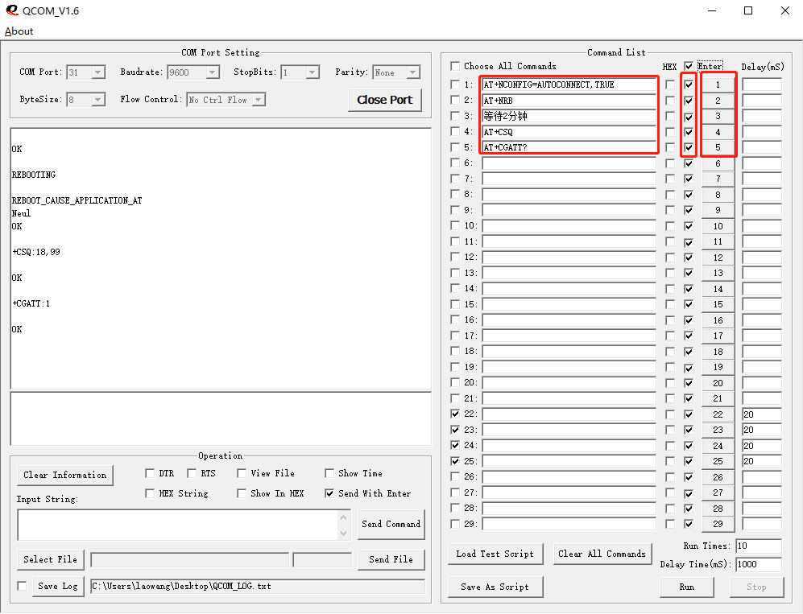

# 如何查看SIM卡是否欠费

套餐中配套赠送的SIM卡使用的期限一般在6-12个月，若你的购买时长已经超过12个月，那么卡是一定已经欠费了。如果没有超过12个月，可使用以下方式查询卡是否欠费。

## 准备

- 下载串口工具QCOM

    链接：https://pan.baidu.com/s/1_EWhwi-y5egI-mKJQafeAw?pwd=1234 
    提取码：1234

- 连接设备

    将开发板右上脚的开关拨到AT-PC模式，并使用USB线将开发板与电脑连接。

    <table><tbody><tr><td></td></tr></tbody></table>

- 设置COM信息

    <table><tbody><tr><td></td></tr></tbody></table>

    COM Port设置为设备管理器里查看到的映射端口，波特率为9600，其他默认设置，点击Open Port 打开端口。

    <table><tbody><tr><td></td></tr></tbody></table>

## 发送指令查询

在右边列表中输入以下,并勾选回车换行，然后依次点击指令后面的数字，发送相应的指令。

指令解释：

|指令 | 解释  |
| ---- |  ------------------------------------------------------------ |
| AT+NCONFIG=AUTOCONNECT,TRUE | 将模组设置为自动联网，这样在模组重启后2分钟内会自动连接网络 |
| AT+NRB| 模组重启 |
|AT+CSQ|查询信号质量，只需关注第一个参数，该参数范围为0-31，若在此范围内表示模组当前有接收到基站的信号，若重启2分钟后第一个参数还是99，则卡可能欠费|
|AT+CGATT?|查询网络附着，返回参数为1时，表示已经附着网络，若重启2分钟后返回参数还是0，则卡已经欠费|

<table><tbody><tr><td></td></tr></tbody></table>
