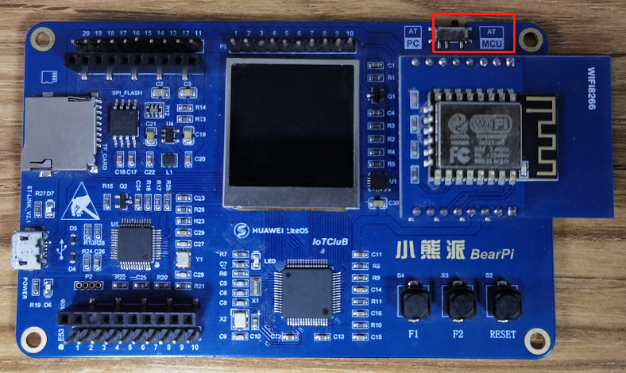
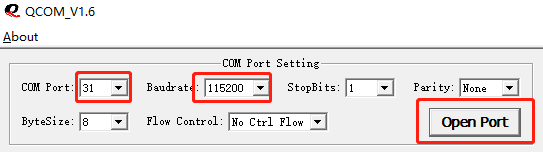
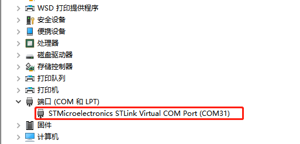
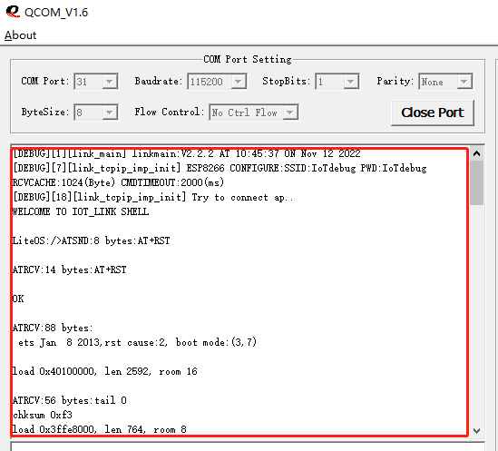

# 如何查看开发板工作日志

## 准备

- 下载串口工具QCOM

    链接：https://pan.baidu.com/s/1_EWhwi-y5egI-mKJQafeAw?pwd=1234 
    提取码：1234

- 连接设备

    将开发板右上脚的开关拨到AT-MCU模式，并使用USB线将开发板与电脑连接。

    <table><tbody><tr><td></td></tr></tbody></table>

- 设置COM信息

    <table><tbody><tr><td></td></tr></tbody></table>

    COM Port设置为设备管理器里查看到的映射端口，波特率为115200，其他默认设置，点击Open Port 打开端口。

    <table><tbody><tr><td></td></tr></tbody></table>

- 查看日志

    在工具的输出栏中会输出开发板的工作日志，若需要技术支持，请复位开发板后，运行至少1分钟，然后复制该区域中的全部内容，提供给技术人员以便定位问题。

    <table><tbody><tr><td></td></tr></tbody></table>
