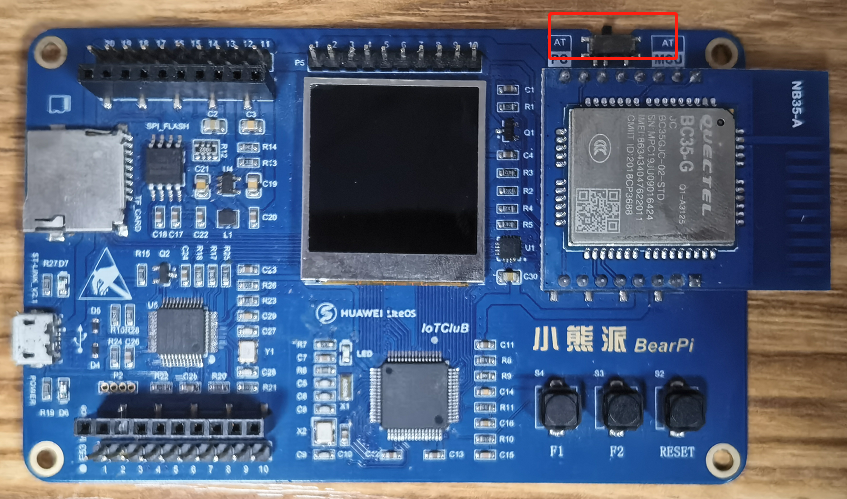
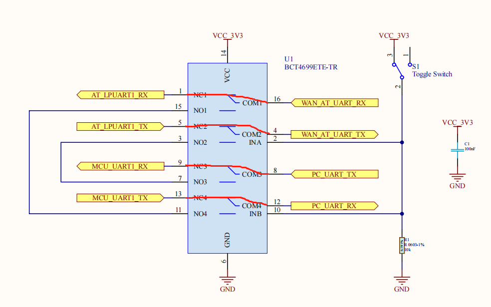
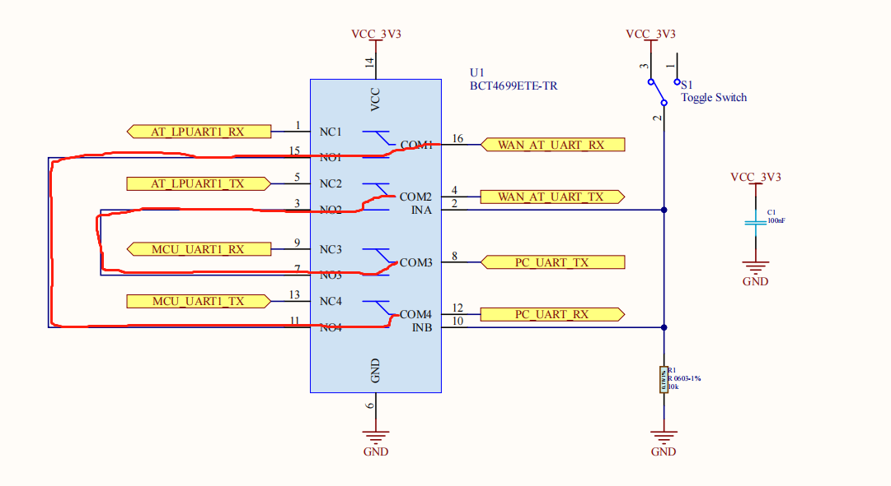

# 如何正确使用串口切换开关

开发板右上角具有一个拨码开关，该开关控制的是一个内部具有四路开关的电子开关芯片。其工作原理如下所示：

<table><tbody><tr><td></td></tr></tbody></table>

1. 开关拨到右边

    当开发板的开关拨到右边时，电子开关芯片的内部四个开关会往上拨，此电路的连接如下图红线所示，通信模组的串口"WAN_AT"会被接到MCU的LPUART串口上，通过MCU发送AT指令与通信模组进行交互，将采集到的传感器数据通过通信模组发送到云端。另外，连接电脑的PC_UART会被接到MCU的UART1上，这样MCU的运行日志就可以发送到电脑上，便于查看MCU工作日志。

    <table><tbody><tr><td></td></tr></tbody></table>

2. 开关拨到左边

    当开发板的开关拨到左边时，电子开关芯片的内部四个开关会往下拨，此电路的连接如下图红线所示，通信模组的串口"WAN_AT"会被接到电脑的PC_UART上，此时可以通过电脑端的串口助手，发送AT指令调试通信模组。
    <table><tbody><tr><td></td></tr></tbody></table>

综上所述，当你要发送数据到云端，你就把开关拨到右边；当你要单独发送AT指令调试通信模组，你就把开关拨打左边

