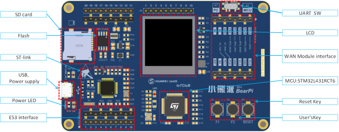
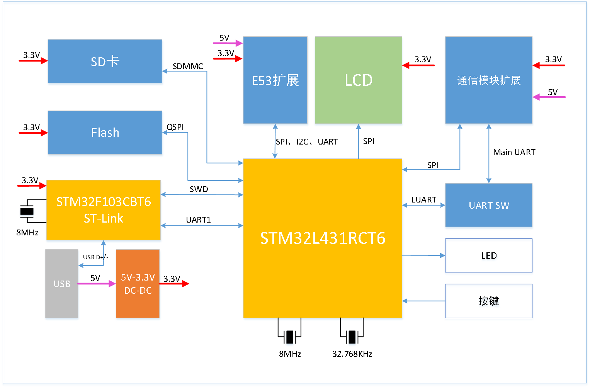
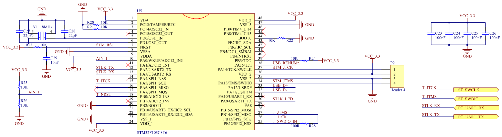
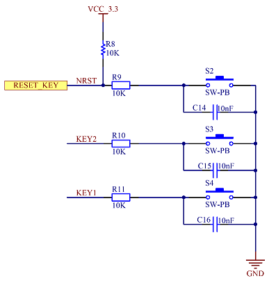
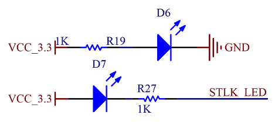
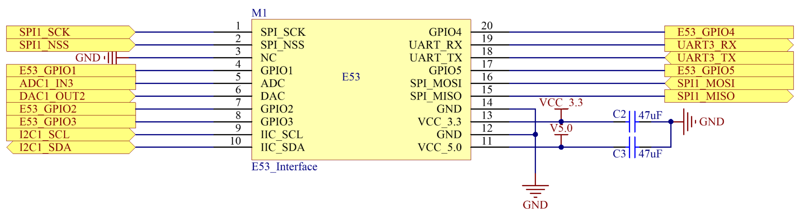
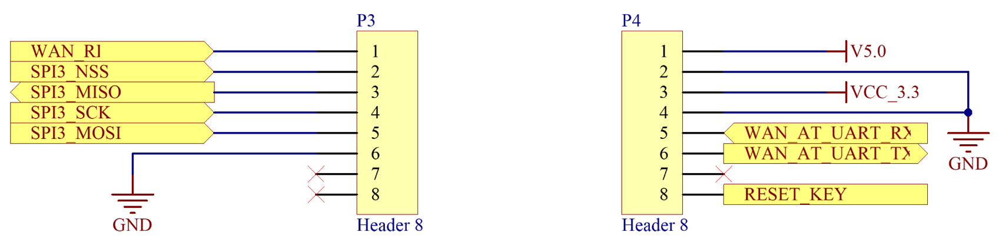
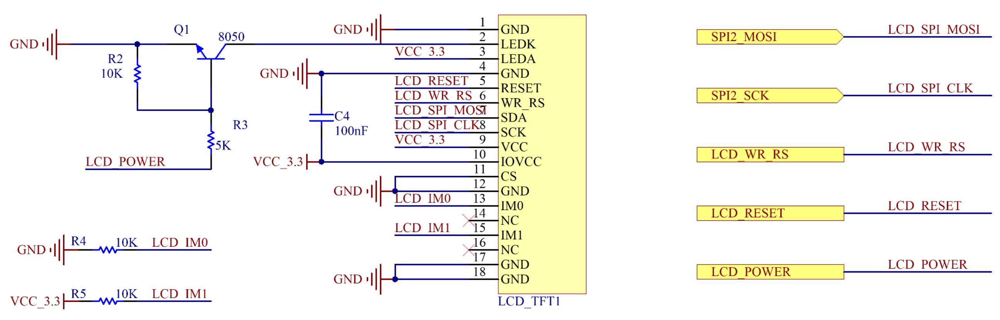
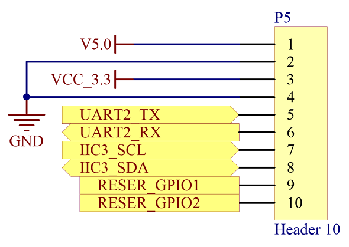

# BearPi-IoT_Std开发板介绍
本文档介绍BearPi-IoT_Std开发板外观、功能、资源及参数规格，通过学习，开发者会对BearPi-IoT_Std开发板有初步认识，并可上手业务开发。
## 开发板简介
BearPi-IoT_Std开发板是由南京小熊派智能科技有限公司联合华为技术有限公司基于STM32L431RCT6设计的高性能物联网开发板。开发板充分考虑物联网感知层设备的多样性，具有强大的可扩展性，用于提供给开发者评估及快速设计相关物联网的应用产品。
### 购买地址 [点击购买](https://item.taobao.com/item.htm?id=608002911209)

## 开发板规格

<table><thead align="left"><tr id="r54b3810e43d24e1887c1d6a41394996b"><th class="cellrowborder" valign="top" width="18.02%" id="mcps1.2.3.1.1">
规格类型

</th>
<th class="cellrowborder" valign="top" width="81.98%" id="mcps1.2.3.1.2">
规格清单

</th>
</tr>
</thead>
<tbody><tr id="r71f534ea66af4191b020408df5978f41"><td class="cellrowborder" valign="top" width="18.02%" headers="mcps1.2.3.1.1 ">
通用规格

</td>
<td class="cellrowborder" valign="top" width="81.98%" headers="mcps1.2.3.1.2 "><ul id="u2a0d06f28d454d30818ced9a0432211b"><li>CPU:STM32L431RCT6, 80MHz</li><li>存储：256K Flash，64KB SRAM</li><li>外扩Flash：外扩8MB SPI Flash</li><li>主板供电：通过USB 5V供电或者外部 5V供电</li><li>传感器：支持E53传感器案例扩展板</li><li>显示屏：1.3’ TFT，240*240分辨率</li><li>LED灯：<ul id="ul0879143622219"><li>上电指示 LED，红色；</li><li>下载指示 LED，橙色；</li><li>用户定义LED，蓝色;</li></ul>
</li><li>按键：一个复位按键，二个功能按键</li><li>SD卡：系统支持最大32Gb的SD 卡存储扩展</li><li>通信：NB-IoT、2G、Wifi</li></ul>
</td>
</tr>
<tr id="rd9b56e759af34950b6887ca1bf5bb7cf"><td class="cellrowborder" valign="top" width="18.02%" headers="mcps1.2.3.1.1 ">
电源特性

</td>
<td class="cellrowborder" valign="top" width="81.98%" headers="mcps1.2.3.1.2 "><ul id="u6568aa052152432aa1f44372445ca634"><li>Micro USB接口，5V供电</li><li>内部有5V转3.3V的DCDC</li><li>MCU供电电压为3.3V，系统IO电压也为3.3V</li></ul>
</td>
</tr>
<tr id="r3563f9df9759486794952d46c5d2d03f"><td class="cellrowborder" valign="top" width="18.02%" headers="mcps1.2.3.1.1 ">
调试接口

</td>
<td class="cellrowborder" valign="top" width="81.98%" headers="mcps1.2.3.1.2 "><ul id="uca57d799e7814925a5bf1b891335bd79"><li>USB转ST-Link</li><li>ST-Link虚拟串口</li></ul>
</td>
</tr>
<tr id="r3e1c86e5f6cd4df0a1b30a08fb8481a2"><td class="cellrowborder" valign="top" width="18.02%" headers="mcps1.2.3.1.1 ">
XTAL

</td>
<td class="cellrowborder" valign="top" width="81.98%" headers="mcps1.2.3.1.2 "><ul id="u612cc2cd0cfe40229263c4f506c0c69c"><li>8MHz</li><li>32.768KHz</li></ul>
</td>
</tr>
<tr id="rae93c5236b084cd2a2c0d5c29027b40e"><td class="cellrowborder" valign="top" width="18.02%" headers="mcps1.2.3.1.1 ">
预留通用接口

</td>
<td class="cellrowborder" valign="top" width="81.98%" headers="mcps1.2.3.1.2 "><ul id="u7c73ebffd89e4092bd65f0d878d59b22"><li>WAN interface（UART）</li><li>I2C*2</li><li>SPI*2</li><li>ADC*1</li><li>UART*3</li></ul>
</td>
</tr>
</tbody>
</table>

## 开发板框架
开发板的系统框图如图下所示。

电路连接关系如下：系统由USB 5V供电，经过DCDC降压至3.3V给系统大 部分器件供电，为系统主要电源；板载ST-Link与MCU采用SWD接口；8M Flash采用四线QSPI与MCU连接；SD卡采用三线SDMMC协议与MCU交互；E53扩展接口支持SPI、I2C、UART等协议；开发板自带1.44寸 LCD，属于 SPI 4-line 接口；通信模块扩展接口可接UART和SPI协议通信的通信模组；LED 灯、按键连接至 MCU 的 GPIO。

## 主板外设接口介绍

### USB 接口

开发板有一个USB接口，为USB
ST-link接口，作用为软件下载/调试/系统供电输入口。

USB
ST-Link接口除了给系统提供电源之外，还是开发板的下载接口，与STM32F103的USB接口相连接，用USB数据线连接至PC之后会映射出一个COM口设备，用来进行开发板和PC端之间的交互，打印开发板的调试信息、下载MCU程序、调试通信模组。STM32F103与MCU之间是通过SWD接口相连接，其原理图如图下所示。

### 按键

开发板带有二个功能按键，和一个系统Reset按键。功能按键可以提供给开发者做功能定义开发，都是使用GPIO口，方向为输入，低电平有效。复位按键是直接接入STM32F103和MCU的硬件复位Pin，按下复位按键，系统自动重启复位。其原理图如图下所示。

### 指示灯

MCU开发板总计有3个LED灯，其中有1个电源指示LED灯（红色）上电就被点亮，1个下载调试LED灯（橙色）上电也常亮，当下载的时候会闪烁，1个提供给用户定义的LED灯（蓝色），都是接入MCU的GPIO，拉高IO口即可点亮。电源LED灯在USB供电正常之后会常亮，如果插入USB之后电源
LED没有被点亮，证明USB供电异常。其原理图如图下所示。

### E53接口

开发板设计有E53接口的传感器扩展板接口，该接口可兼容所有E53接口的传感器扩展板，实现不同案例场景的快速搭建。该接口可接入UART、SPI、I2C、ADC等通信协议的传感器，其原理图如图下所示。

### 通信扩展接口

开发板设计有通信扩展板的扩展接口，该接口可接入NB-IoT、2G、Wifi、Lora等不同通信方式的通信扩展板，以满足不同场景上云的需求，其原理图如图下所示。

### LCD接口

 LCD 接口是4-Line SPI，其电路原理图接口定义如图下所示。开发板板载一个FPC材质的LCD屏幕，屏幕的分辨率为240\*240。

### 预留接口

预留接口有一组UART和一组I2C接口以及两个通用IO口，可供开发者自定义开发使用，定义如图下所示。

